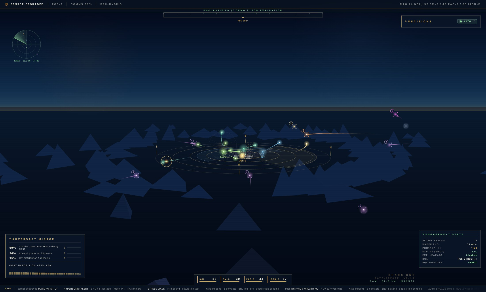
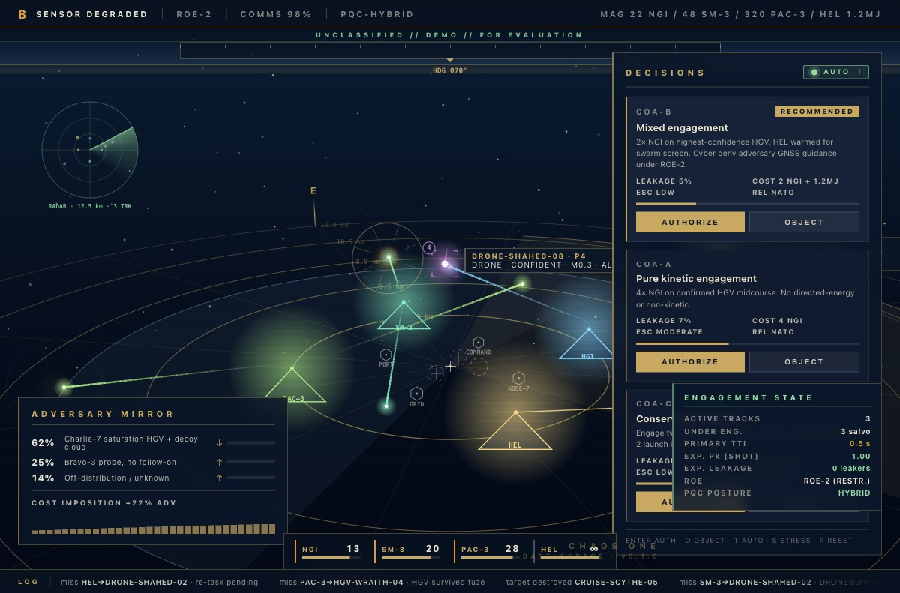
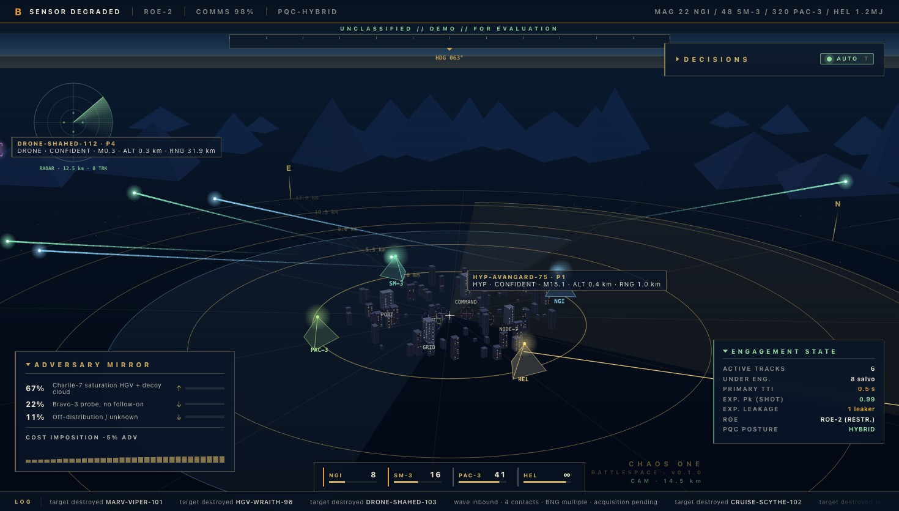

<p align="center">
  
</p>

<h1 align="center">Chaos One</h1>

<p align="center">
  <em>Decision superiority under tempo.</em><br/>
  A browser-rendered Iron-Dome-flavoured air&nbsp;and&nbsp;missile defense interface,
  driven by explicit linear algebra and continuous weapon-target assignment.
</p>

<p align="center">
  <a href="https://github.com/EgorKhaklin/chaos-one/actions/workflows/backend.yml"></a>
  <a href="https://github.com/EgorKhaklin/chaos-one/actions/workflows/codeql.yml"></a>
  
  
  
  <a href="LICENSE"></a>
</p>

---

## The picture

A continuous, never-resetting battlespace. Procedural threat waves
inbound from beyond a 3D mountain ring. Four kinetic batteries
defending a 3D city. A weapon-target assignment loop running at
350&nbsp;ms. Lead-angle quadratic guidance solved every frame.

<p align="center">
  
  &nbsp;
  
</p>

<table>
<tr><td><b>Threats</b></td><td>HGV / BM / MARV / CRUISE / DRONE / HYP — six classes with their own Mach bands, apogees, spawn radii. Continuous WAVE + DRIZZLE + periodic HYPERSONIC ALERT generators. Mach&nbsp;14+ glide vehicles spawn from 70-92&nbsp;km.</td></tr>
<tr><td><b>Defenders</b></td><td>NGI (Mach 10, exoatmospheric) · SM-3 (Mach 7.6, upper-tier) · PAC-3 (Mach 5, terminal) · IRON-D (Mach 4.4, short-range Tamir). Each carries its own envelope, magazine, reload, and Pk-vs-class matrix.</td></tr>
<tr><td><b>Engagement</b></td><td>Predicted-impact-point filter drops out-of-bubble threats. Priority-greedy WTA with Iron-Dome biases assigns the right defender to each threat. High-value targets in the vital bubble get a 2-interceptor shoot-shoot-look salvo. Re-engages on miss automatically.</td></tr>
<tr><td><b>Math</b></td><td>4×4 view/projection matrices · quadratic lead-angle collision-course solution · Catmull-Rom trail interpolation · painter's-algorithm depth sort · Lambertian shading · mulberry32 seeded PRNG · 30 Hz numerical derivative for target velocity.</td></tr>
</table>

---

## The headline math

Each interceptor solves the classical lead-angle quadratic against the
live target velocity every frame:

<p align="center">
  <code>(v<sub>I</sub>² − |v<sub>T</sub>|²) t² − 2(d · v<sub>T</sub>) t − |d|² = 0</code>,
  &nbsp;<code>d = r<sub>T</sub>(now) − r<sub>I</sub>(now)</code>
</p>

The smallest positive root `t*` is the lead time; the missile aims at
`r_T(now + t*)` and recomputes. `v_T` is the numerical derivative of
the threat's Bezier trajectory. This is the same lead solution real
proportional-navigation seekers use, applied to a closed-form world.

Self-test endpoint at [`/battlespace/selftest`](http://127.0.0.1:8124/battlespace/selftest)
runs **8 math assertions** — lead-angle (head-on / off-axis / receding-
infeasible), `planIntercept` feasibility, PAC-3 envelope reject, PIP
classification, and WTA distributing 4 distinct defenders across 3
threats. Document title becomes `PASS` or `FAIL`.

---

## Run it

```bash
git clone https://github.com/EgorKhaklin/chaos-one.git
cd chaos-one/backend
make install
make protos
.venv/bin/uvicorn chaos_backend.web.app:app --port 8124 --host 127.0.0.1 --reload
open http://127.0.0.1:8124/battlespace
```

Or build the single-binary launcher:

```bash
make package          # → dist/chaos-one
./dist/chaos-one      # binds 8000, opens /battlespace
```

---

## Operator controls

| Input | Effect |
|---|---|
| Mouse wheel on canvas | Zoom (2.5–60&nbsp;km) |
| Left-drag canvas | Orbit + elevation |
| **T** | Toggle AUTO-ENGAGE (on by default) |
| **S** | Drop a 14-threat stress wave |
| **C** | FREE-CAM lock |
| **Home** / `=` | Reset camera |
| **Enter** / **A** | Authorize the recommended COA |
| **O** | Object to the recommended COA |
| Panel chevrons | Collapse / expand Decisions / Adversary Mirror / Engagement State |

From the browser console (`window.__chaos`):

```js
__chaos.snapshot()       // engagement state JSON
__chaos.runSelfTest()    // 8-test math suite
__chaos.runWTA()         // current assignment list
__chaos.fireOnce()       // one WTA pass manually
__chaos.stress()         // 14-threat saturation wave
__chaos.hypersonic(n)    // drop n HYP threats now
__chaos.seed(n)          // reseed wave generator (reproducible)
__chaos.freezeAt(sec)    // pin clock + camera for testing
__chaos.unfreeze()       // resume
```

---

## What's running

Three splash kinds, three engagement outcomes — visually distinct so
the operator reads the picture at a glance:

| Splash | Look | Means |
|---|---|---|
| `kill` | Amber/yellow ring, 60 px max | Successful intercept |
| `leak` | **Crimson + black smoke ring, red X marker** | Threat hit the city |
| `selfdestruct` | Compact white-blue flash | Interceptor self-destructed (orphan or fuze-miss) |

Salvo state machine — a missile is only retired on a **confirmed
hit**; everything else coasts:

```
  queued ─────► armed ─────► inflight ─────► splash (kill)
                                │
                                └──► orphaned ──► selfdestruct
                                       ↑
                                  (target killed
                                   by another shooter,
                                   or fuze missed,
                                   or threat leaked)
```

---

## Architecture

```
                    browser
                       │
                       │  /battlespace          canvas + math + JS
                       │  /battlespace/selftest 8-assertion math harness
                       │  /ops                  operator dashboard
                       │  /play /play/stream    scenario runner + SSE
                       │  /engagements*         audit / diff / rerun
                       │
                    FastAPI
                  ┌────┴────┐
                  │ web/    │ landing + battlespace + operations
                  │ audit/  │ SHA-256 Merkle-chained JSONL writer / reader / verifier
                  │ storage/│ SQLite engagement catalog
                  │ simulation/  RK4 kinematics, scenario builders
                  │ services/    discrimination / COA / adversary stubs
                  │ proto/  │ gRPC contracts (for external integrations)
                  └─────────┘
```

The battlespace renderer is **fully client-side** — once the HTML is
served, the math, threat generator, defender doctrine, WTA, and
physics all run in the browser. The FastAPI app owns audit, scenario
replay, the engagement catalog, and the operator dashboard. They
communicate only over the bus of HTML, SSE, and JSON.

---

## Repository layout

```
chaos-one/
  backend/
    src/chaos_backend/
      web/battlespace.py     Iron Dome renderer (single self-contained HTML + JS)
      web/operations.py      Live operator dashboard (/ops)
      web/app.py             FastAPI application
      audit/                 SHA-256 Merkle-chained JSONL writer + reader + verifier
      simulation/            RK4 kinematics, scenario builders, gRPC streaming
      services/              Discrimination / COA / adversary stubs
      storage/               SQLite engagement catalog
      grpc_adapters.py       proto ↔ dataclass translation
      cli.py                 chaos-backend-cli
      launcher.py            chaos-one (single-binary entrypoint)
    tests/                   pytest suite — 146 passing, 86% coverage
    chaos-one.spec           PyInstaller spec
  .github/workflows/         backend (ruff + mypy + pytest) + codeql
  assets/                    screenshots
  LICENSE                    Apache 2.0
```

---

## Status

Conceptual prototype. **Not deployed**, not adjudicated against
operational standards, not a substitute for fielded systems.
Discrimination is a mock ensemble; the COA generator returns canned
bundles; the adversary model produces sinusoidally drifting weights.
These are placeholders for the ML and game-theoretic work that would
replace them in a production system.

What is real and tested: the math (4×4 projection, lead-angle
quadratic, WTA greedy assignment, painter's-algorithm depth sort),
the engagement flow (procedural waves → WTA → lead-pursuit physics →
splash / leak / self-destruct), the audit chain (SHA-256 Merkle
JSONL), the test discipline.

The shape of the system is what the prototype demonstrates; the
inside of each box is intentionally stubbed.

---

<p align="center">
  <sub>Apache 2.0 — see <a href="LICENSE">LICENSE</a></sub>
</p>
