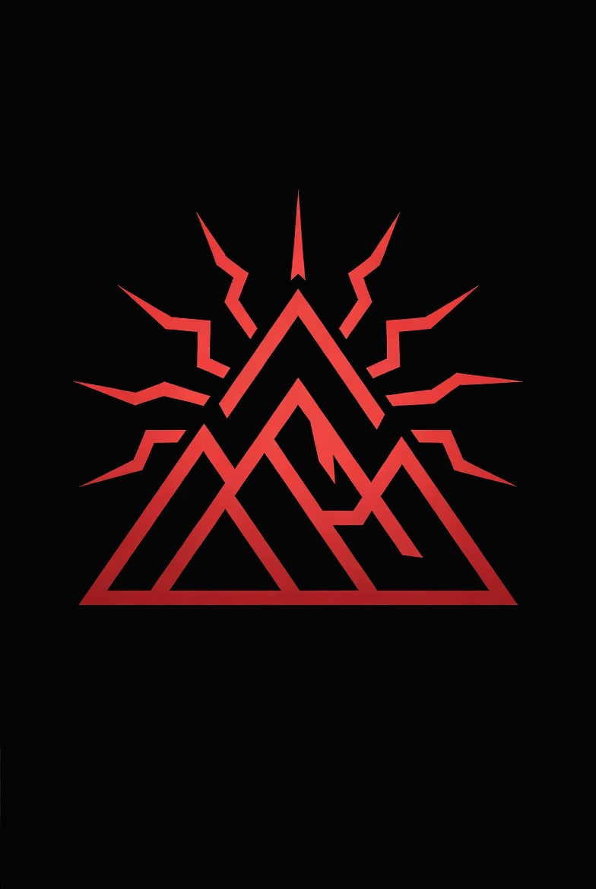

<p align="center">
  
</p>

<h1 align="center">Chaos One</h1>

<p align="center">
  <a href="https://github.com/EgorKhaklin/chaos-one/actions/workflows/backend.yml"></a>
  <a href="https://github.com/EgorKhaklin/chaos-one/actions/workflows/codeql.yml"></a>
  <a href="https://github.com/EgorKhaklin/chaos-one/blob/main/backend/pyproject.toml"></a>
  <a href="https://github.com/EgorKhaklin/chaos-one/blob/main/unity/Packages/manifest.json"></a>
  <a href="LICENSE"></a>
</p>

Conceptual decision-support interface for next-generation air and missile
defense. Unity 6 HDRP front end, Python gRPC backend. Apache 2.0.

This is a prototype of a command interface for the late-2020s threat
environment: hypersonic glide vehicles, drone and missile swarms, saturation
attacks, electronic warfare, cyber-degraded sensors. It treats the problem
as **decision superiority under uncertainty**, not as a sensors problem.
Calm under tempo, honest uncertainty, operator-owned authority, and
cryptographically signed audit are the load-bearing design commitments.

---

## The five surfaces

| Surface | Role |
|---|---|
| **The Stage** | Battlespace render. Tracks carry state-driven envelopes (Fresnel rim, confidence-modulated saturation, disagreement striping) and altitude-blended emissive trails. |
| **Mode HUD** | One persistent strip: operational mode (A–F), ROE envelope, comms health, crypto posture, magazine summary. Amber on degraded modes, red on cyber-suspect or autonomous fire. |
| **Decisions Panel** | Up to three COA cards with countdowns, Authorize / Object actions, recommended-COA visual privileging. Hotkeys: Enter authorizes, O objects. |
| **Adversary Mirror** | Three weighted playbook hypotheses, 30-second delta indicators, rolling cost-imposition sparkline. |
| **Calm Channel** | Bottom-strip event ticker. Audit context, not alarms; threats render on the Stage and decisions render on the Decisions Panel. |

Off-stage but architecturally first-class:

| Surface | Role |
|---|---|
| **Audit Reel** | Append-only, SHA-256 Merkle-chained JSONL log of every event the operator saw. Built around the assumption that an external party will eventually audit what the operator did and why. Reader + verifier + replay view. |

---

## Architecture

```
[L7 Adversary model]  ←→  [L6 Chaos One UI]  ←→  [L5 Effector orch.]
                                ↕
[L4 Decision logic]   ←   [L3 Discrim / intent]   ←   [L2 Fusion]   ←   [L1 Sensors]
                                                                  ↑
                                                            [L0 Substrate]
```

Python owns L1–L4 and L7 over gRPC. Unity owns L5 and L6. An in-process
scripted client lets the front end run end-to-end demos without the
backend attached.

Every UI surface reads from a single typed `EventBus`; no surface reads
state from another surface directly. Services register in a small
`ServiceRegistry` and are resolved by interface. The audit log writer
subscribes to the same bus, so post-event review sees exactly what the
operator saw.

---

## Repository layout

```
chaos-one/
  unity/                              Unity 6 HDRP project
    Assets/_ChaosOne/
      Scripts/
        Core/         EventBus, ServiceRegistry, SceneBootstrap
        Threats/      Track + archetype + visuals orchestrator
        Sensors/      Coverage volumes + sensor nodes
        Cameras/      Cinemachine director + hotkey switcher
        Decisions/    COA, ROE envelope, mode state machine, COA queue
        UI/           Mode HUD, Decisions Panel, Adversary Mirror,
                      Calm Channel, Audit Reel, Perf overlay (F1)
        Net/          Backend client + scripted / gRPC implementations
        Audit/        Hash-chained JSONL writer + reader + verifier
        Scenarios/    Wraith director (M1 hero shot), demo event driver
      Shaders/        Envelope, Trail (hand-written ShaderLab)
      UI/             UXML templates + USS theme
      Tests/Editor/   NUnit EditMode tests
  backend/                            Python 3.11+ gRPC server
    proto/chaos_one.proto             service contracts
    src/chaos_backend/
      services/                       discrimination, COA, adversary
      simulation/                     RK4 kinematics, scenario builders
      grpc_adapters.py                proto <-> dataclass translation
      server.py                       gRPC server entry
      cli.py                          chaos-backend-cli
      launcher.py                     chaos-one (single-binary entrypoint)
      web/                            FastAPI dashboard + SSE streaming
      storage/                        SQLite engagement catalog
      observability.py                structlog + request_id middleware
    tests/                            pytest suite (140+ tests)
    Makefile                          install / protos / lint / type /
                                      test / ci / bench / package / clean
    chaos-one.spec                    PyInstaller spec for the launcher
  .github/workflows/
    backend.yml                       CI: ruff + mypy + pytest
    codeql.yml                        Security analysis
    release.yml                       Cross-platform binary builds
  LICENSE                             Apache 2.0
```

---

## Quickstart — one binary

```
cd backend
make install
make protos
make package        # PyInstaller builds dist/chaos-one (or Chaos One.app)
./dist/chaos-one    # boots the dashboard and opens the browser
```

The resulting binary is self-contained: no Python, no pip install, no
venv on the host. Cross-platform binaries are built by GitHub Actions
on every `v*` tag push; grab them from the [Releases](https://github.com/EgorKhaklin/chaos-one/releases) page.

### Launching the Unity build alongside

When a Unity build exists, the launcher can spawn it as a child
process so one icon boots the whole prototype. Three ways to point at
the Unity binary:

```
./dist/chaos-one --unity-app /path/to/Chaos\ One.app   # explicit
CHAOS_UNITY_APP=/path/to/Chaos\ One.app ./dist/chaos-one   # env var
# or drop the Unity build into a `unity-build/` directory next to
# the chaos-one binary — auto-discovered on launch.
```

The Unity child is terminated cleanly when the backend exits.

---

## Quickstart — backend (development)

```
cd backend
make install        # .venv + dev extras
make protos         # generate gRPC stubs from chaos_one.proto
make test           # full suite with coverage (75% floor)
make demo           # full simulated engagement, JSON to stdout
make server         # gRPC server on 127.0.0.1:50051
```

`chaos-backend-cli` runs subcommands against the in-process services:

```
chaos-backend-cli demo --scenario peer_salvo --seed 42 --tracks 4
chaos-backend-cli classify --track-id TRK-001 --speed 2400 --altitude 28000
chaos-backend-cli generate-coa --tracks A B C D --envelope ROE-2
chaos-backend-cli playbook
chaos-backend-cli trajectory --apogee 35000 --duration 120
chaos-backend-cli scenario peer_salvo --seed 42
```

Output is JSON on stdout — pipe into `jq` for filtering.

---

## Quickstart — Unity

1. Install Unity 6 LTS via Unity Hub.
2. Open the `unity/` folder as a project. Hub will resolve the HDRP
   packages from `Packages/manifest.json`.
3. Create a scene at `Assets/_ChaosOne/Scenes/Battlespace.unity`.
4. Drop a single `SceneBootstrap` GameObject into the scene. It will
   spawn the non-UI services (mode state machine, COA queue, adversary
   mirror service, audit log writer, backend bootstrap, demo driver).
5. For each UI surface, create a `UIDocument` GameObject and assign the
   matching UXML from `Assets/_ChaosOne/UI/` plus the controller script
   (`ModeHUD`, `DecisionsPanel`, `AdversaryMirror`, `CalmChannel`).
6. For the M1 hero shot: add a `SplineContainer` GameObject with
   `DepressedTrajectoryBuilder`, then a separate GameObject with
   `WraithDirector` referencing that container.

Press F1 in Play mode to toggle the perf overlay.

---

## CI

GitHub Actions runs ruff check, ruff format, mypy strict, and pytest
with coverage on Python 3.11 and 3.12 against the `backend/` tree.
Generated gRPC stubs are produced during the workflow; they are not
committed. Workflow at [`.github/workflows/backend.yml`](.github/workflows/backend.yml).

Unity-side tests are NUnit EditMode suites under
`unity/Assets/_ChaosOne/Tests/Editor/` and run via Unity Test Runner.

Pre-commit hooks (ruff, whitespace, YAML/TOML/JSON validation, large-file
guard) are configured in [`.pre-commit-config.yaml`](.pre-commit-config.yaml).
Enable with `pip install pre-commit && pre-commit install`.

---

## Status

Conceptual prototype. The system is **not deployed**, has not been
adjudicated against operational standards, and is not a substitute for
real-world fielded systems. Discrimination is a mock ensemble that
returns deterministic scripted votes; the COA generator returns canned
bundles; the adversary model produces sinusoidally drifting weights.
These are placeholders for the ML and game-theoretic work that would
replace them in a production system.

What is real: the architecture, the event flow, the audit chain, the
gRPC interface contracts, the test discipline. The shape of the system
is what the prototype demonstrates; the inside of each box is
intentionally stubbed.

---

## License

Apache 2.0. See [LICENSE](LICENSE).
